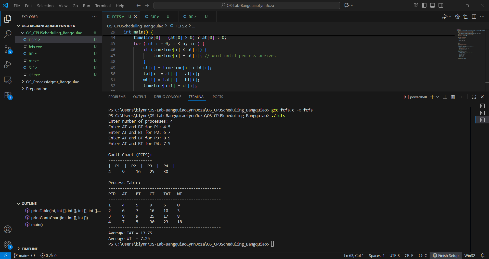
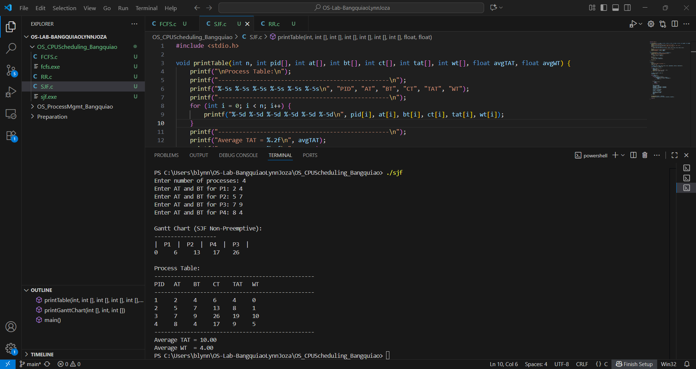
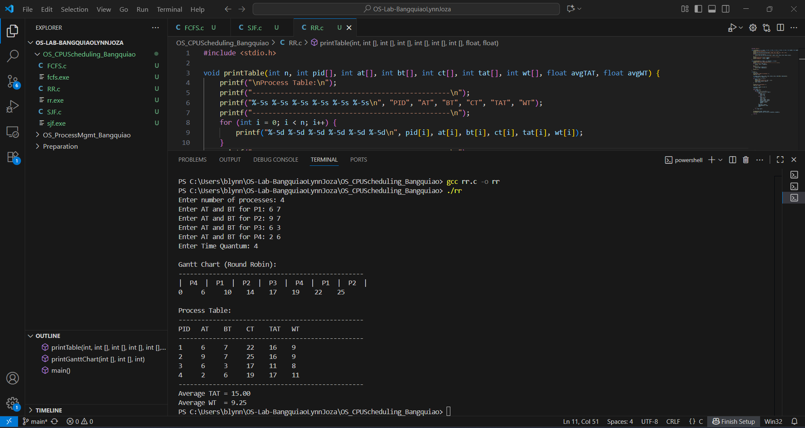

# OS LAB 2 - CPU Scheduling Simulation

- ### First Come First Serve (FCFS)

The First Come First Serve (FCFS) scheduling algorithm is one of the simplest scheduling methods. In this approach, processes are executed in the order in which they arrive in the ready queue, much like a queue at a service counter where the first customer to arrive is served first. Once a process begins execution, it runs until completion without interruption, making FCFS a non-preemptive algorithm. This simplicity makes it easy to implement and understand. However, one drawback of FCFS is that it can lead to what is called the “convoy effect,” where shorter processes are forced to wait behind longer processes, which increases the average waiting time.

- ### Shortest Job First (SJF, Non-Preemptive)

The Shortest Job First (SJF) scheduling algorithm selects the process with the shortest burst time for execution. If multiple processes are waiting in the ready queue, the CPU chooses the one with the smallest required execution time. In this project, I implemented the non-preemptive version, which means that once a process starts running, it cannot be interrupted until it finishes. SJF is optimal in the sense that it minimizes the average waiting time compared to other scheduling methods. However, it has a major limitation in that long processes may experience starvation if shorter jobs continue to arrive, leaving the longer processes waiting indefinitely.

- ### Round Robin (RR)

The Round Robin (RR) scheduling algorithm is designed to be fair by giving each process a fixed amount of CPU time, known as a time quantum. When a process is given the CPU, it can only run for the duration of its time quantum. If the process does not finish within that time, it is preempted and placed at the back of the ready queue, and the CPU moves on to the next process. This cycle continues until all processes are completed. Round Robin is a preemptive scheduling algorithm and is widely used in time-sharing systems because it ensures that all processes receive CPU time. Its performance, however, strongly depends on the length of the time quantum. If the quantum is too small, the system may spend too much time performing context switches, leading to inefficiency. On the other hand, if the quantum is too large, the algorithm behaves similarly to FCFS, reducing its fairness advantage.

