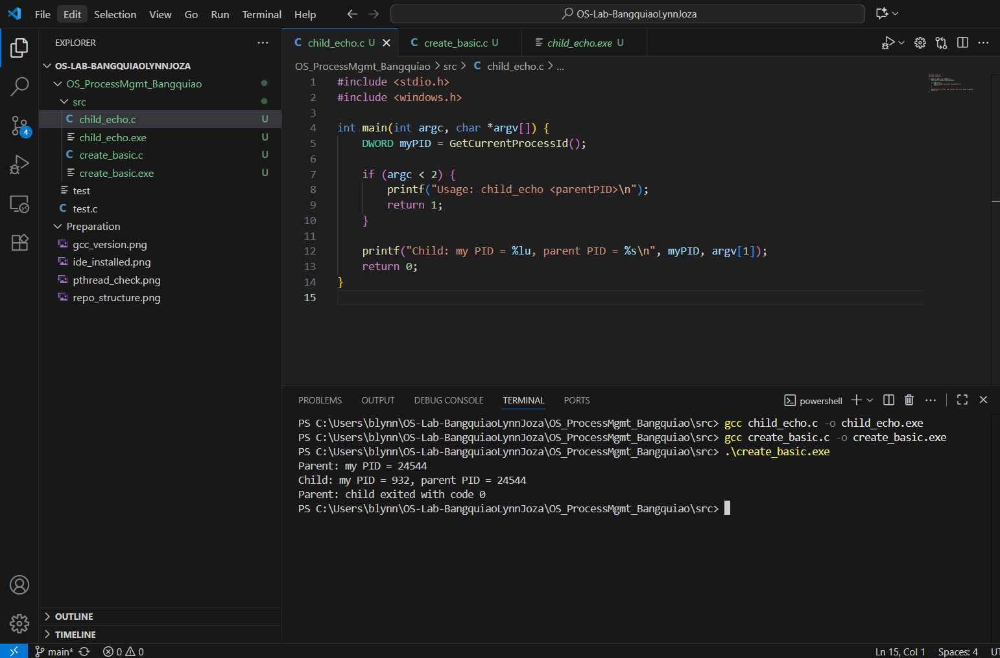
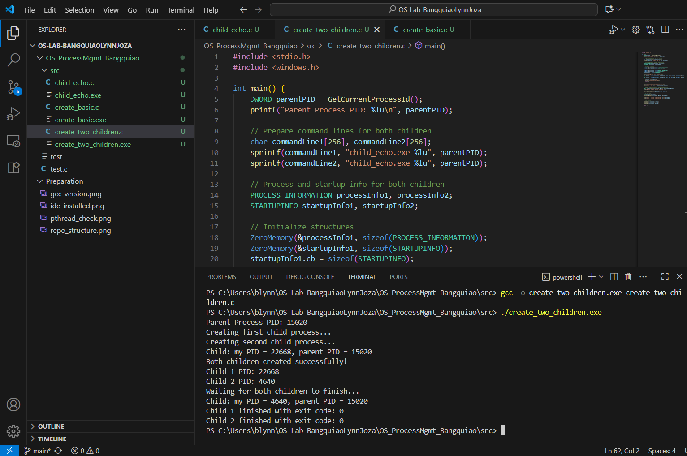
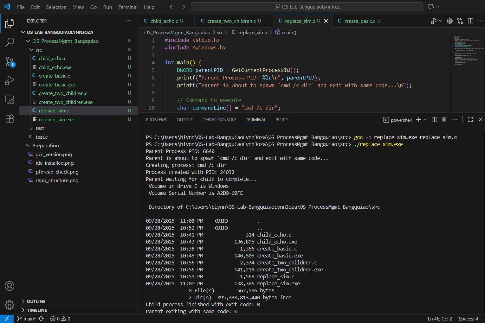
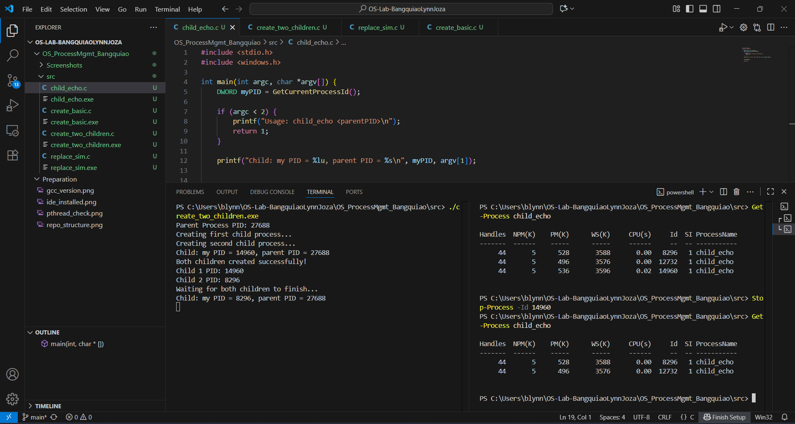

# OS LAB 1 - Process Management

## Build Instructions For VS Code with MinGW-w64

#### 1. Install MinGW-w64
- Download MinGW-w64 from SourceForge
- Add mingw64\bin to your system PATH environment variable
#### 2. Setup VS Code
- Install C/C++ extension from Microsoft
- Open the OS_ProcessMgmt_Lastname folder in VS Code

#### 3. Compile C files
In the integrated terminal (powershell), cd into src/ and run:

```bash
 gcc create_basic.c -o create_basic.exe

 gcc child_echo.c -o child_echo.exe

 gcc create_two_children.c -o create_two_children.exe

 gcc replace_sim.c -o replace_sim.exe
```

#### 4. Run executables
```bash
./create_basic.exe

./create_two_children.exe

./replace_sim.exe
```

# Sample Outputs

#### Task A – Creating a Single Child



The parent process successfully printed its own Process ID and then created the child process using CreateProcess. The child process correctly received the parent's PID as a command-line argument and printed both its own newly assigned PID and the parent's PID, confirming the established parent-child relationship. 

#### Task B – Creating Two Children



This task successfully demonstrated the creation of multiple child processes. The parent launched two instances of child_echo.exe in quick succession, and each child was assigned a unique PID. The use of WaitForMultipleObjects with the TRUE parameter for bWaitAll meant the parent process waited for both children to terminate before proceeding. 


#### Task C – Simulating exec()



The parent process spawned a command shell to execute the dir command. Contrary to a true exec() function, the parent process did not have its image replaced; instead, it acted as a manager. The parent waited for the spawned cmd process to finish using WaitForSingleObject, captured its exit code, and then terminated itself, returning the same exit code. 

#### Task D – Managing Processes in PowerShell



This task provided practical insight into external process management using the child_echo program from Task A. Running Get-Process child_echo in PowerShell allowed for the real-time observation of the long-running child processes due to their internal Sleep call. The difference between terminations was clear: a normal termination occurred when the child's Sleep ended and it exited with code 0, while using Stop-Process resulted in a forced, immediate termination. This forced termination was observed when the parent program reported a child exit code like 1 instead of 0, indicating an abnormal end and demonstrating the potential for abrupt process cessation without clean-up.


